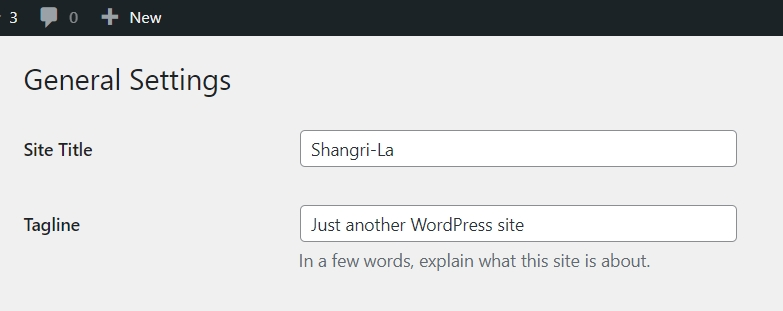

# WordPress Theme學習筆記

This is a study note for SAIT MMDA324 Wordpress theme class.

## Update

🆕Comments 留言

## Table of contents

- [WordPress Theme](#theme)
  - [層級](#hierarchy)
  - [Templates](#templates)
- [元件](#elements)
  - [Link file](#head)
  - [Header](#header)
  - [Footer](#footer)
  - [h1](#h1)
  - [Useful resources](#useful-resources)
- [Author](#author)

## WordPress Templates

### 層級

### Templates

順序為推薦建檔順序，名稱一定要按照規定取名。
**代表他是一個區塊，需要用include或是get功能放進某一頁裡面才看得到

- style.css -> 最主要的通用CSS，主題資訊要寫在裡面，其他CSS可以依照不同樣板各別開檔案
- functions.php -> 要寫了funciton後臺才會開功能哦!
- index.php -> 最籠統的一頁，沒有特別分類的都是它(預設放blog post的地方也是這裡)
- header.php / footer.php -> 可以共用的區塊**
- page.php -> 所有不是post的頁面
- single.php -> 單個post的頁面
- sidebar.php -> 開啟widgets的地方，跟header一樣可以共用**
- archive.php -> 分類過的頁面，預設是照月份分類
- comments.php -> 留言的區塊**
- searchform.php -> 搜尋欄**
- search.php -> 搜尋結果頁面

## First Step

先幫主題取名才找得到!

```css
@import url('記得先import字體!');
/* 
Theme Name: Client Name 2022
Author: Your Name
Version: 0.1.0
Author URI: https://www.sample.com/
Description: The theme we built in MMDA 324 Web Communication 3 (Fall 2022)
 */
 ```

## 元件

### Link file

如何把CSS連到WordPress?

- 先把連結功能加進functions.php
(實際使用情況詳見functions.php line 3)

```php
add_theme_support('html5', array('comment-list', 'comment-form', 'search-form', 'gallery', 'caption', 'style', 'script'));
add_theme_support('title-tag');
```

- 把CSS加入序列(get_stylesheet_uri()是用於自動定位style.css這個檔案的路徑)
(實際使用情況詳見functions.php line 6)
```php
function linked_assets()
{
    wp_enqueue_style('main', get_stylesheet_uri());
    if (is_page()) {
        wp_enqueue_style('page-styles', get_template_directory_uri() . '/page.css');
    } else if (is_single()) {
        wp_enqueue_style('page-styles', get_template_directory_uri() . '/single.css');
    }
}
```

- 把序列裡的檔案(剛剛連的CSS)加入WP
(實際使用情況詳見functions.php line 16)

```php
add_action('wp_enqueue_scripts', 'linked_assets');
```

- 最後在head裡面加入wp_head()
(實際使用情況詳見header.php line 7)
```php
<head>
    <meta charset="utf-8">
    <meta name="viewport" content="width=device-width, initial-scale=1">
    <?php wp_head(); ?>
</head>
```


### Header


### Footer


### h1

#### clickable logo 
用h1和<a>把LOGO圖片包起來，以下範例
(實際使用情況詳見header.php line 12)

```php
<h1>
<a href="<?php echo get_home_url(); ?>">
    /images/web-communicaitons-logo.svg" alt="<?php bloginfo('name'); ?>">
</a>
</h1>
```
#### blog_info()

就是WordPress的基本內容，設定在後台的setting > general

- bloginfo('name') >> 網站名稱 (Website Title)
- bloginfo('description') >> 網站簡述 (Tagline)

### Menu

### Widgets


### Comments

## Author

- Codepen - [TingHueiChen](https://codepen.io/TingHueiChen)
- Frontend Mentor - [@hejkeikei](https://www.frontendmentor.io/profile/hejkeikei)
- Twitter - [@hej_keikei](https://twitter.com/hej_keikei)
